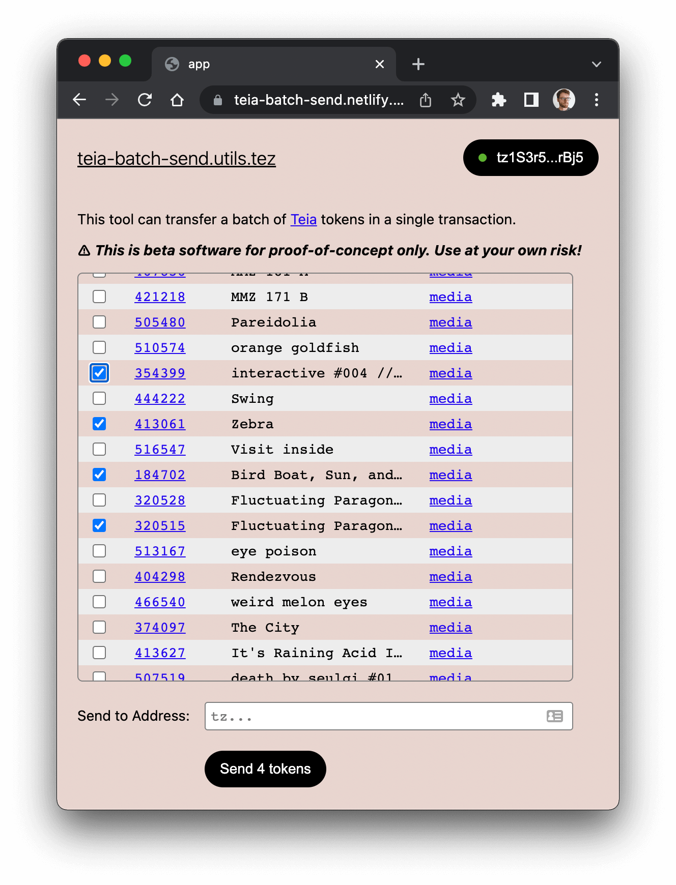

# teia-batch-send

A dApp to batch send multiple [Teia](http://teia.art/) tokens in one transaction.

> :warning: This is untested software. Use the dApp at your own risk.



## Concept

This is a rough proof-of-concept of a decentralized app (dApp) for use in a blockchain context, in this case Tezos. See [this thread](https://twitter.com/mattdesl/status/1495322443610791940) for the basic idea. As this dApp is entirely contained in a single IPFS-hosted HTML file, it should provide the following benefits:

- DDoS resistance; users can bookmark and pin the IPFS hash locally to ensure the application is reliably accessible.
- immutable and "ossified", in that a change to the frontend would produce a new addressable hash
- public and verifiable update mechanism: to get the "latest version" of the site, see the [teia-batch-send.utils.tez](https://app.tezos.domains/domain/teia-batch-send.utils.tez) domain name. Changes to this domain's contents will be public (easily analyzable), verifiable, and previous iterations will remain intact on the chain.

This is not a perfectly decentralized application, as it still relies on an indexer and trusted RPC nodes.

## IPFS

The website is entirely contained in a single HTML file, accessible via the following [IPFS](https://ipfs.io/) hash.

```sh
ipfs://QmdtwM1u3ELnGY3p5F4uBf1dgPQGUvYNffYHaeasbhdFec
```

The domain [teia-batch-send.utils.tez](https://app.tezos.domains/domain/teia-batch-send.utils.tez) has a Content URL that will point to this hash.

### Online Mirror

You can also access the site at the following link:

https://teia-batch-send.netlify.app/

## Install Locally

Tested with `node@17.1.0` and `npm@8.1.2`.

```sh
cd teia-batch-send
npm install
npm run dev
```

## Credits

This dApp was created by [@mattdesl](https://twitter.com/mattdesl), using [PureSpider's FA2 Token Batch tool](https://batch.xtz.tools/) as a reference.

## License

MIT, see [LICENSE.md](http://github.com/mattdesl/fa2-batch-send/blob/master/LICENSE.md) for details.
